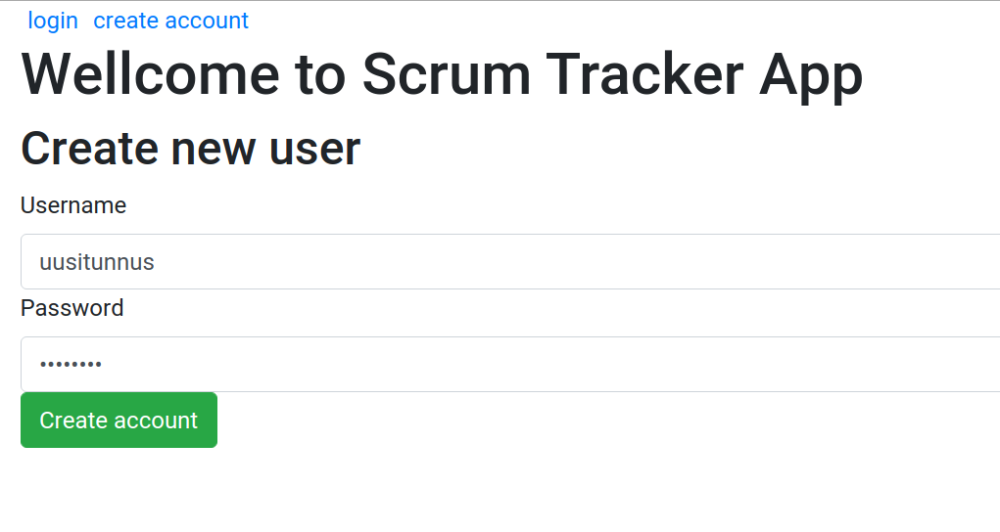
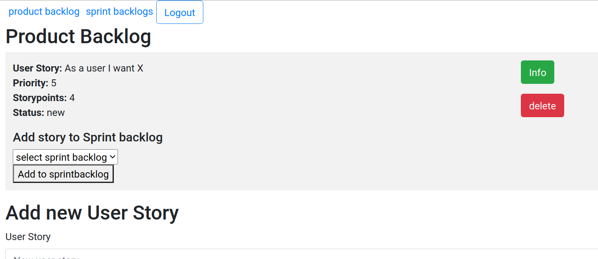
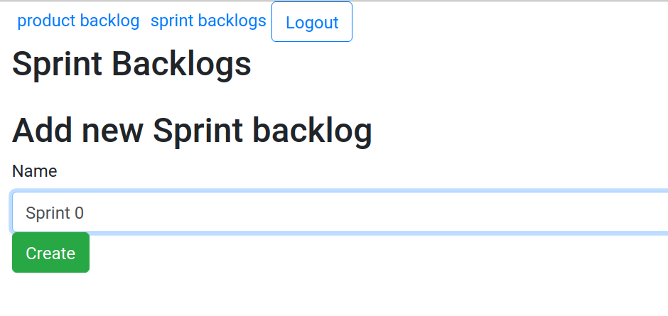

# Scrum Tracker App käyttöohje

## Kirjautuminen ja tunnusten luominen

Sovellukseen kirjaudutaan käyttäjätunnuksella ja salasanalla:

Klikkaamalla create account linkkiä pääsee luomaan uudet tunnukset:

## Käyttö

Sovellukseen voi lisätä käyttäjätarinoita product backlog näkymässä 

Käyttäjätarinoiden poistaminen onnistuu klikaamalla delete-painiketta.

Käyttäjätarinan tarkemmat tiedot näkee klikkaamalla Info-painiketta. Tarkempien
tietojen näkymässä käyttäjätarinaa voi muokata:

Käyttäjätarinan tietojen näkymässä voi lisätä tarinaan liittyviä teknisiä
tehtäviä

Lisäksi käyttäjätarinan tietojen näkymässä voi lisätä tarinaan liittyviä
vapaamuotoisia kommentteja.

Sprint backlogs näkymässä voi lisätä sprint backlogeja

Product backlog näkymässä voi liittää käyttäjätarinan johonkin sprint backlogiin:

Sprint backlogeihin voi lisätä myös erillisiä 'ylläpitotehtäviä', jotka ovat
käyttäjätarinoiden kaltaisia, mutta ne näkyvät vain sprint backlogissa:

